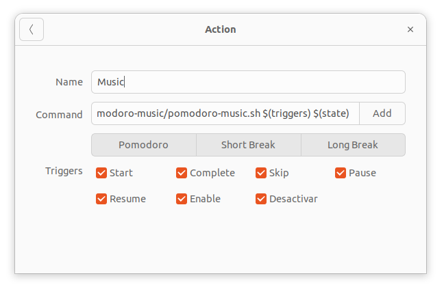

# gnome-pomodoro-music



This project is designed to enhance the gnome-pomodoro experience by playing music during your pomodoro sessions and breaks.

## Overview

The script `pomodoro-music.sh` allows users to play, pause, resume, and stop music during their pomodoro sessions. It supports different states such as "short-break" and "long-break" for a more customized experience.

## Requirements

- **mpg123**: A command-line MP3 player.
- **gnome-pomodoro**: A desktop application for Pomodoro time management.

Install these requirements using your package manager. For example, on Ubuntu, you can use:

```bash
sudo apt install mpg123 gnome-pomodoro
```

## Music Files

You must provide your own music files; this project does not include any. Place your music files in the `focus-music` directory. The following music files are expected:

- `focus.mp3`
- `relax.mp3`

## Script Usage

```bash
./pomodoro-music.sh {start|break|disable|pause|resume|skip} {pomodoro|short-break|long-break} {debug}
```

### Parameters:

- **Trigger**:
  - `start`: Starts the pomodoro or breaks depending on the state.
  - `break`: Starts a short or long break.
  - `disable`: Stops any currently playing music.
  - `pause`: Pauses the currently playing music.
  - `resume`: Resumes the paused music.
  - `skip`: Skips the current track.

- **State**: Optional, can be `pomodoro`, `short-break`, or `long-break`.

- **Debug**: Optional, pass `debug` to enable debug mode for logging.

## Example Configurations

### Normal Configuration
```bash
pomodoro-music.sh $(triggers) $(state)
```

### Debug Mode Configuration
```bash
pomodoro-music.sh $(triggers) $(state) debug
```

## Logging

Logs are saved in the file located at:
```
$HOME/gnome-pomodoro-music/pomodoro-debug-log.txt
```

## License

This project is licensed under the [LICENSE](LICENSE).
